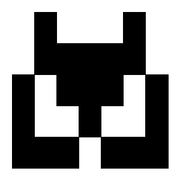

# Github-like Userpic (Avatar) Generator

Oversimplified Github-like userpic (avatar) generator.

[](https://github.com/astral-sh/ruff)
[](https://pypi.python.org/pypi/tiny-userpic)
[](https://pypi.python.org/pypi/tiny-userpic)

## Features

- Generate unique avatars from text input (email, username, etc.)
- Create both PIL Image and SVG outputs
- Customizable size, colors, and padding
- Deterministic output (same input always produces the same avatar)

## Installation

```bash
pip install tiny-userpic
```

## Usage

The library provides several ways to generate avatars:

### 1. Random Generation (Non-deterministic)
Generate a unique random avatar each time.

```python
from tiny_userpic import make_userpic_image

# Generate random avatar
random_image = make_userpic_image(
    size=(7, 5),
    image_size=(300, 300),
    background="white",
    foreground="black"
)
random_image.save("random_avatar.png")
```

### 2. With Custom Seed (Deterministic)
Generate an avatar with a specific seed for reproducible results.

```python
from tiny_userpic import make_userpic_image

# Generate avatar with specific seed
seeded_image = make_userpic_image(
    size=(7, 5),
    image_size=(300, 300),
    background="white",
    foreground="black",
    seed=42  # Any integer value will work as seed
)
seeded_image.save("seeded_avatar.png")
```

### 3. From Text Input (Deterministic)
Generate an avatar from any text input (email, username, etc.). The same input will always produce the same avatar.

```python
from tiny_userpic import make_userpic_image_from_string, make_userpic_svg_from_string

# Generate avatar from email
email = "user@example.com"

# As PNG image
image = make_userpic_image_from_string(
    text=email,           # Input text to generate avatar from
    size=(7, 5),         # Pattern size (width, height)
    image_size=(300, 300), # Output image size in pixels
    background="white",   # Background color (can be color name, hex or RGB tuple)
    foreground="black"    # Foreground color (can be color name, hex or RGB tuple)
)
image.save("avatar.png")

# As SVG
svg = make_userpic_svg_from_string(
    text=email,
    size=(7, 5),
    image_size=(300, 300),
    background="white",
    foreground="black"
)
with open("avatar.svg", "w") as f:
    f.write(svg)
```

### Common Parameters
All generation methods share these parameters:
- `size`: Tuple of (width, height) for the pattern size
- `image_size`: Tuple of (width, height) for the output image size in pixels
- `background`: Background color (can be color name, hex or RGB tuple)
- `foreground`: Foreground color (can be color name, hex or RGB tuple)
- `padding`: Optional padding around the pattern (default: (20, 20))
- `mode`: Image mode for PNG output (default: 'RGB', can be 'RGBA' for transparency)

## Examples

### Basic (from string)


### Colored


### Transparent


### Small


### Large


### Random (non-deterministic)


### Seeded (deterministic)

