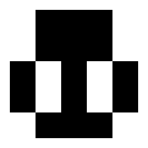

# Github-like Userpic (Avatar) Generator

Oversimplified Github-like userpic (avatar) generator.

[](https://github.com/astral-sh/ruff)
[](https://pypi.python.org/pypi/tiny-userpic)
[](https://pypi.python.org/pypi/tiny-userpic)

Turns any text — an email, a username, a UUID — into a symmetric identicon-style
avatar, rendered as a PIL image or an SVG string. The same input always produces
the same picture. The only dependency is Pillow.

## Installation

```bash
pip install tiny-userpic
```

Requires Python 3.10 or newer. The package installs a single top-level module
named `userpic`.

## Quickstart

```python
from userpic import make_userpic_image_from_string

make_userpic_image_from_string(text="user@example.com").save("avatar.png")
```



## API

Four functions share the same parameters and differ only in the output format
and in where the pattern comes from:

|                                  | returns     | pattern comes from       |
|----------------------------------|-------------|--------------------------|
| `make_userpic_image`             | `PIL.Image` | `seed` or system entropy |
| `make_userpic_svg`               | `str` (SVG) | `seed` or system entropy |
| `make_userpic_image_from_string` | `PIL.Image` | `text`                   |
| `make_userpic_svg_from_string`   | `str` (SVG) | `text`                   |

### Images

```python
from userpic import make_userpic_image

# a new random avatar on every call
make_userpic_image(size=(7, 5)).save("random.png")

# the same integer seed always gives the same avatar
make_userpic_image(size=(7, 5), seed=42).save("seeded.png")

# transparency: RGBA mode plus a fully transparent background
make_userpic_image(
    size=(7, 5),
    mode="RGBA",
    background=(255, 255, 255, 0),
    foreground=(0, 0, 128, 255),
).save("transparent.png")
```

### SVG

```python
from userpic import make_userpic_svg, make_userpic_svg_from_string

svg = make_userpic_svg_from_string(text="user@example.com", size=(7, 5))
with open("avatar.svg", "w") as file:
    file.write(svg)

# seeded, without the background rectangle
svg = make_userpic_svg(size=(7, 5), background=None, seed=42)
```

### Parameters

| name         | default      | description                                                                               |
|--------------|--------------|-------------------------------------------------------------------------------------------|
| `text`       | —            | input string for the `*_from_string` functions                                            |
| `size`       | `(5, 5)`     | pattern size in cells as (width, height); the width must be at least 2                    |
| `image_size` | `(300, 300)` | output size in pixels                                                                      |
| `padding`    | `(20, 20)`   | blank border around the pattern, in pixels                                                 |
| `background` | `"white"`    | color name, hex string or RGB/RGBA tuple; `None` omits the background rectangle in SVG    |
| `foreground` | `"black"`    | same formats as `background`                                                               |
| `mode`       | `"RGB"`      | PIL image mode, image functions only; use `"RGBA"` for transparency                        |
| `seed`       | `None`       | any integer for reproducible output; omit for a random avatar                              |

The pattern has to fit into the image: `image_size` minus twice the `padding`
must leave at least one pixel per cell, otherwise a `ValueError` is raised.

## Examples

| Basic                          | Colored                            | Transparent                                |
|--------------------------------|------------------------------------|--------------------------------------------|
|    |    |    |

| Small                          | Large                              | Seeded                                     |
|--------------------------------|------------------------------------|--------------------------------------------|
|    |        |              |

The images are generated by `just examples`.

## License

[MIT](LICENSE)
